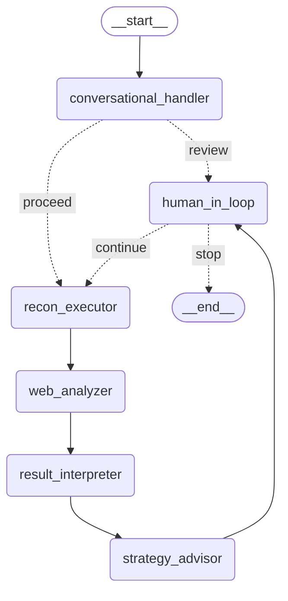

# AdaptiveFuzz

[](https://github.com/vgnshwar/AdaptiveFuzz/issues)

> [!WARNING]
> **Notice: Architecture Update**
>
> The code in this `main` branch is the original Python proof-of-concept. I am completely rebuilding the project to a new, more mature agent architecture (Interpreter, Core Engine, Sandbox, RAG, etc.).
> 
> All the active work is happening in the [`migrate/design-flow`](https://github.com/vgnshwar/AdaptiveFuzz/tree/migrate/design-flow) branch right now, and it will be merged here soon. If you want to see the new setup and architecture flow, please check that branch.

🔗 [Watch a demo of AdaptiveFuzz in action](https://drive.google.com/file/d/11ldkNL88Gsc22rEQPEMN-XeqM0S3iD1S/view?usp=sharing)


AdaptiveFuzz is an LLM-powered multi-agent framework designed to automate the reconnaissance (enumeration) phase of penetration testing. It moves beyond static scripts and predefined patterns by emulating the adaptive, step-by-step reasoning of a human red-team operator.

The system intelligently plans enumeration tasks, executes them, analyzes the results, and proposes new strategies based on its findings, all while keeping a human operator in the loop for final approval.

---

### Expected Outcome

1. **Information Gathering**: Collect as much information as possible about a target's systems, networks, and infrastructure. 

2. **Vulnerability Identification**: This research aims to uncover weak points, open ports, and other vulnerabilities that can be exploited in later stages of an attack. 

3. **Attack Strategy Planning**: The gathered intelligence helps attackers tailor their approach and increases the chances of a successful breach.

---

### Installation

1. Clone the repository:
   ```bash
   git clone https://github.com/vgnshwar/AdaptiveFuzz.git
   cd AdaptiveFuzz
   ```

2. Create and activate a virtual environment:
   ```bash
   python3 -m venv .venv
   source .venv/bin/activate
   ```

3. Configure & Install Dependencies
	```bash
	cp .env.example .env
	pip install -r requirements.txt
	```

4. Run the application:
   ```bash
   langgraph dev
   ```

---

### Core Concepts

This project is built on two key technologies: LangGraph and the Model Context Protocol (MCP).

- **LangGraph**: The entire workflow is built using LangGraph. Each step in the reconnaissance process is a node in the graph, represented by a specialized LLM-powered agent. This makes the system modular, stateful, and easy to debug.

- **Model Context Protocol (MCP)**: MCP is the communication bridge that allows the LLM agents to interact with actual security tools. The project uses `FastMCP` to serve Python-based reconnaissance tools, which the agents can call to scan targets and gather information.

---

### Architecture

The system operates as a team of specialized agents, each handling one part of the reconnaissance loop.



#### Workflow Loop

1. **Conversational Handler**: The process begins here. The user provides a target IP and a high-level goal (e.g., "Scan this target for web vulnerabilities"). This agent decomposes that goal into a list of specific, executable tasks (e.g., port scanning, banner grabbing).

2. **Recon Executor**: This agent receives the task list and executes each one by calling the appropriate MCP tool. It runs the tools to get raw data from the target.

3. **Web Analyzer**: The raw tool output (e.g., "Port 80 open, banner: Apache/2.4.18") is passed to this agent. It uses the web_search tool to gather external context, such as identifying service versions, associated technologies, or known CVEs for the discovered services.

4. **Result Interpreter**: This agent synthesizes all the information from the raw scan results and the web search context into a clean, human-readable list of concise security findings.

5. **Strategy Advisor**: Based on the unified findings, this agent acts like a senior penetration tester. It reviews the situation and proposes exactly three prioritized, strategic next steps to continue the enumeration. These strategies are formatted as new tasks for the Recon Executor.

6. **Human-in-the-Loop**: This is the critical control point. The system presents the findings and the three proposed strategies to the human user. The user must choose which strategy to pursue (1, 2, or 3) or type 'stop' to end the test.

If the user chooses a strategy, the graph routes back to the Recon Executor, which runs the new tasks. This iterative cycle of Execute -> Analyze -> Strategize -> Get Human Approval is what makes the system "adaptive."

---

### MCP Tools

The framework is pre-configured with tools served via FastMCP:
- `port_scanner`: Scans a target IP for a list of open ports.
- `banner_grabber`: Connects to open ports to grab service banners.
- `web_search`: Performs a Google web search to gather external intelligence.

---

### License
This project is licensed under the MIT License - see the [LICENSE](LICENSE) file for details.
