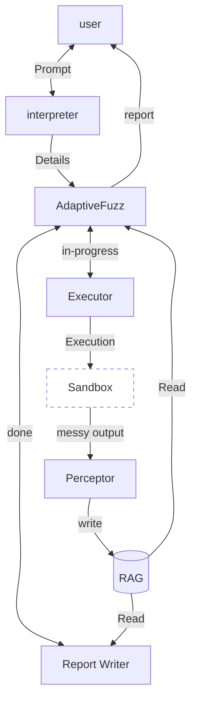

# AdaptiveFuzz

AdaptiveFuzz is an intelligent, agentic framework that leverages Large Language Models (LLMs) to dynamically analyze, execute, and report on systems and software.

## Architecture

### Components

- **User**: Interacts with the system by providing initial prompts, and eventually receives the final analysis report.
- **Interpreter**: Processes the user's initial prompt and translates it into structured details and actionable tasks for the main orchestration engine.
- **AdaptiveFuzz (Core Engine)**: The central orchestration agent that manages the workflow lifecycle, interacting with the executor and utilizing context from the RAG storage.
- **Executor & Sandbox**: The `Executor` runs tasks and test cases within an isolated `Sandbox` environment to ensure safety and system integrity. 
- **Perceptor**: Captures the "messy output" from the sandbox execution (such as raw logs, stdout, or traces) and structures it into meaningful insights.
- **RAG (Knowledge Base)**: A Retrieval-Augmented Generation datastore. The Perceptor writes processed execution results here, which are later read by the core engine to inform subsequent steps and by the report writer to summarize findings.
- **Report Writer**: Once AdaptiveFuzz completes its execution loop, this component compiles a comprehensive final report based on the intelligence stored in the RAG database.
